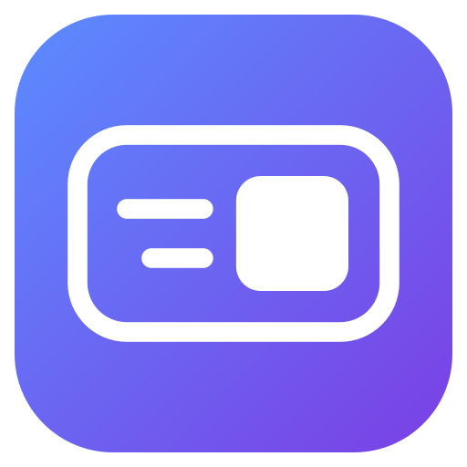

<p align="center">
  
</p>

<h1 align="center">Fling</h1>

<p align="center">
  <b>A lightweight macOS window manager that lives in the menu bar.</b><br>
  <br>
  Place windows with the keyboard, drag or throw them into place, save layouts,<br>
  and script all of it from the command line or a URL. Native Swift, free and MIT licensed.
</p>

<p align="center">
  <a href="#install">Install</a> · <a href="#quick-start">Quick Start</a> · <a href="#command-line">Command Line</a> · <a href="#automation">Automation</a> · <a href="LICENSE">License</a>
</p>

---

### Why Fling?

- **Rectangle's shortcuts, and more.** Halves, corners, thirds, fourths and sixths use the same keys as Rectangle, so switching costs you nothing.
- **Drag, snap or throw.** Drop a window on a screen edge or the Snap Panel, or hold a mouse button (or rest fingers on the trackpad) and flick it toward one of 16 positions.
- **Windows go back where they were.** Unplug a monitor, wake the Mac or reopen an app, and its windows return to their last spot without any setup.
- **Layouts you can undo.** One layout can arrange every app you have open. Run it from a shortcut, a URL, a display change, wake or a Focus mode, and put everything back with Undo Layout.
- **Scriptable.** `flingctl` and `fling://` URLs work from shell scripts, Shortcuts, Raycast, Alfred or a Stream Deck.
- **Small and native.** It's a Swift menu bar app for macOS 14 and later.

---

## Install

```sh
git clone https://github.com/luca-bv/Fling.git && cd Fling && ./install.sh
```

Builds from source and puts Fling in `/Applications`, signed with the local "Fling Dev" certificate (`make cert`, created on first run) so the Accessibility grant survives updates. Needs the Swift toolchain (`xcode-select --install`).

**Update:** run `./install.sh` again. From a clone it builds what you have checked out; run from anywhere else, it keeps its own clone in `~/.local/share/Fling` and pulls before building.

**Install elsewhere:** `DEST=~/Applications ./install.sh`

---

## Quick Start

1. Launch Fling. Its icon appears in the menu bar
2. Allow it in System Settings → Privacy & Security → **Accessibility** (needed to move other apps' windows)
3. Press `⌃⌥ ←` to snap a window to the left half, press it again to cycle ½ → ⅔ → ⅓
4. Open **Settings** (`⌘,` from the menu) to assign more shortcuts and tune drag, throw and layouts

> [!NOTE]
> If you also run Rectangle, quit it first. It uses the same default shortcuts.
>
> **Float on Top** also needs **Screen Recording** (Privacy & Security → Screen & System Audio Recording). Nothing else does.

---

<details>
<summary><b>All Features</b></summary>

### Keyboard
- **Shortcuts**: halves, corners, thirds, fourths, sixths, fill, maximize, center, nudge, size, move, displays, Spaces and window controls
- **Repeat to cycle**: repeating a half cycles ½ → ⅔ → ⅓; nudge and size repeat while held
- **Win Arrow Keys**: step between halves and corners like Windows
- **Keyboard Grid**: moved to its own app, [FlingGrid](https://github.com/luca-bv/FlingGrid)
- **Left/right-specific shortcuts**: e.g. right ⌘ + arrows, recorded from Settings → Shortcuts

### Mouse & Trackpad
- **Drag to snap**: screen edges and corners, each configurable, separately for portrait displays, with footprint previews and haptics
- **Snap Panel**: a panel of tiles to drop windows on, plus custom **snap targets**
- **Drag to restore**: drag a snapped window away to restore its size
- **Resize neighbors**: drag a shared edge to resize the windows on both sides
- **Window Throw**: hold `⌃⌘`, a mouse button, or rest 3–5 fingers on the trackpad and lift all but one; move toward one of 16 configurable positions and release
- **Quick Throw**: tap a modifier while moving the cursor to throw the window the way you were heading
- **Move/resize by holding modifiers**
- **Double-click title bar** to maximize

### Filling the Screen
- **Fill the Rest**: after snapping a window, pick another window (click or press 1–9) for the space left over. You can turn it on or off separately for shortcuts, drags and throws (it's off for throws by default). After a shortcut, it only shows while you keep the keys held, so it stays out of your way
- **Multiple windows**: 2×2 and 2×3 tiles, cascade, app halves
- **Pin Mode**: keeps one app in a strip; everything else fills the rest
- **Stash**: tuck windows at the screen edge, with color tabs, delay and ⌘-only; Stash All, Toggle and Cycle
- **Float on Top**: keep any window above the others (`⌃⌥⌘P` toggles). Fling shows a live mirror of the window; click it to use the real one. Needs Screen Recording permission

### Custom Positions & Layouts
- **Custom positions**: fractions or points, repeat cycles, per-display
- **Layouts**: arrange all your apps by shortcut, URL, display connect/disconnect, wake, or as windows open
- **Undo Layout**: running a layout records where every window was first, so Undo Layout puts them all back, including the layouts that run by themselves on wake or a display change
- **Per-layout behavior**: snap everything back as soon as you move a window by hand, or let its own shortcut undo it

### Display Memory
- Windows go back to where they were for each display setup when you plug in or unplug a display, rearrange displays or wake the Mac
- Reopened apps' windows return to their last spot
- No setup needed

### Other
- **Gaps** and **Dock-aware resizing**
- **Context menu at the cursor** (`⌃⌥⌘M`)
- **Hideable menu bar icon** and **launch at login**
- **Configuration**: export/import as JSON, iCloud Drive sync, and an optional `~/.config/fling/config.json` that Fling keeps up to date and reloads when you edit it (dotfiles-friendly)
- **Diagnostics**: Settings → Diagnostics lists recent actions and explains why a window didn't move (fixed-size window, unresponsive app, missing permission), with a copyable report
- **Command line and URLs**: `flingctl` and `fling://` URLs run actions, custom positions and layouts from scripts, Shortcuts and launchers

</details>

<details>
<summary><b>Keyboard Shortcuts</b></summary>

Four layers, all built on `⌃⌥` and clear of macOS's own shortcuts. Rectangle's keys are unchanged, so switching from Rectangle or Rectangle Pro needs no relearning.

**`⌃⌥` places the window**

| Shortcut | Action |
|---|---|
| `⌃⌥ ← → ↑ ↓` | Left / Right / Top / Bottom Half (repeat: ½ → ⅔ → ⅓) |
| `⌃⌥ U I J K` | Top Left / Top Right / Bottom Left / Bottom Right |
| `⌃⌥ D F G` | First / Center / Last Third |
| `⌃⌥ E R T` | First / Center / Last Two Thirds |
| `⌃⌥ 1 2 3 4` | First / Second / Third / Last Fourth |
| `⌃⌥ L ; '` | Top Left / Center / Right Sixth |
| `⌃⌥ , . /` | Bottom Left / Center / Right Sixth |
| `⌃⌥ ↩` | Maximize |
| `⌃⌥ C` | Center |
| `⌃⌥ − =` | Smaller / Larger (hold to repeat) |
| `⌃⌥ ⌫` | Restore |

**`⌃⌥⇧` is a variant of the same key**

| Shortcut | Action |
|---|---|
| `⌃⌥⇧ ↑` | Maximize Height |
| `⌃⌥⇧ ↩` | Almost Maximize |
| `⌃⌥⇧ ← →` | Fill Left / Right |
| `⌃⌥⇧ C` | Upper Center |
| `⌃⌥⇧ 1 4` | First / Last Three Fourths |

**`⌃⌥⌘` moves between screens and opens tools**

| Shortcut | Action |
|---|---|
| `⌃⌥⌘ ← →` | Previous / Next Display |
| `⌃⌥⌘ [ ]` | Previous / Next Space |
| `⌃⌥⌘ P` | Float on Top |
| `⌃⌥⌘ M` | Fling menu at the cursor |

**`⌃⌥⌘⇧` stashes** (one key if Caps Lock is remapped to Hyper)

| Shortcut | Action |
|---|---|
| `⌃⌥⌘⇧ ← →` | Stash Left / Right |
| `⌃⌥⌘⇧ ↓` | Toggle Stashed Windows |

Everything else (nudge, move to edge, Win Arrow Keys, tiles, Pin Mode…) has no default. Assign keys in **Settings → Shortcuts** (`⌘,` from the menu); only your changes are saved, so improved defaults still reach you.

</details>

<details>
<summary><b>Command Line</b></summary>

<a id="command-line"></a>

`make install-cli` links `flingctl` into `~/.local/bin` (set `PREFIX` for another location). It talks to the running Fling (opening it if needed), prints results, and exits non-zero with the reason when something fails.

```sh
flingctl left-half                          # any action; `flingctl actions` lists them
flingctl --app Safari top-left-sixth        # target an app's front window by name or bundle ID
flingctl frame 0 25 1200 800                # exact frame, top-left of the main display
flingctl layout "Deep Work"                 # apply a layout; `flingctl save-layout "Deep Work"` saves one
flingctl windows --json                     # also: displays, layouts, customs, actions
flingctl config export > fling.json         # and: flingctl config import fling.json
```

</details>

<details>
<summary><b>Automation</b></summary>

<a id="automation"></a>

Every action, custom position and layout can be run by URL, so anything that opens URLs can drive Fling:

```sh
open -g "fling://execute-action?name=left-half"        # action names: the menu titles, kebab-cased
open -g "fling://execute-custom?name=Wide%20Center"     # a custom position, by name
open -g "fling://execute-layout?name=Deep%20Work"       # a layout, by name
open -g "fling://save-layout?name=Deep%20Work"          # save the current windows as a layout (replaces one with that name)
```

**Layouts per Focus mode (Shortcuts app)**

1. Automation → New Automation → Focus → pick a Focus → "When Turning On"
2. Add the **Open URLs** action with `fling://execute-layout?name=Deep%20Work`
3. Turn off "Ask Before Running"
4. Add another for "When Turning Off" with your everyday layout

**Other triggers the same way**

- Shortcuts' App automation (when Zoom opens → meeting layout), Time of Day, or Wi-Fi network (home vs office desk)
- A terminal alias or Raycast/Alfred script command running `open -g "fling://…"`
- Stream Deck or BetterTouchTool buttons that open a URL

</details>

<details>
<summary><b>Building from Source</b></summary>

```sh
make run    # builds build/Fling.app and opens it
make test   # unit tests (geometry, models, config, command parsing)
make smoke  # moves a throwaway test window through real actions and prints PASS/FAIL
```

Run `make cert` once first. It creates a self-signed "Fling Dev" signing certificate in your login keychain, so rebuilds keep the Accessibility grant. Without it, builds are ad-hoc signed and macOS forgets the grant after every rebuild.

</details>

<details>
<summary><b>Releases</b></summary>

```sh
make dmg VERSION=0.2.0   # → build/Fling-0.2.0.dmg
```

The disk image holds a universal app (Apple Silicon and Intel) signed with the "Fling Dev" certificate, an Applications shortcut, and `Read Me First.txt` with install steps for testers.

- **Not notarized**: on testers' Macs, Gatekeeper blocks the first launch. They allow it once in System Settings → Privacy & Security → **Open Anyway** (steps are in the read-me). Notarization needs an Apple Developer ID ($99/year).
- **Always sign releases with the same certificate**: macOS ties the Accessibility grant to it, so testers keep their permission across updates. `make dmg` refuses to build ad-hoc. Back up the certificate: in Keychain Access, export "Fling Dev" (certificate and private key) as a .p12. A new certificate means every tester re-grants Accessibility.
- **Versioning**: bump `VERSION` for each release. The build number is the commit count.

</details>

<details>
<summary><b>Project Layout</b></summary>

| File | What |
|---|---|
| `Sources/Fling/FlingApp.swift` | SwiftUI app, preferences, menu bar menu |
| `Sources/Fling/AppState.swift` | Action dispatch, restore/cycling, custom positions, layouts, Pin Mode, triggers |
| `Sources/Fling/Geometry.swift` | Actions, frame math, snap areas and throw directions (tested) |
| `Sources/Fling/Models.swift` | Custom position, layout, display memory and URL-to-command models (tested) |
| `Sources/Fling/Window.swift` | Accessibility API: find windows, set frames, minimize/close/full screen; screens |
| `Sources/Fling/Hotkeys.swift` | Shortcut model and defaults; global hotkeys (Carbon, plus the event tap for left/right-specific ones) |
| `Sources/Fling/Gestures.swift` | Event tap: drag snapping, Window Throw, Quick Throw, move/resize, footprint overlay |
| `Sources/Fling/Trackpad.swift` | Trackpad finger-count trigger (private MultitouchSupport) |
| `Sources/Fling/SnapPanel.swift` | Snap Panel tiles shown while dragging |
| `Sources/Fling/FillRest.swift` | Fill the Rest: pick-a-window panel for the space left after snapping |
| `Sources/Fling/Stash.swift` | Edge stashing |
| `Sources/Fling/FloatingWindows.swift` | Float on Top: live ScreenCaptureKit mirrors in floating panels |
| `Sources/Fling/DisplayMemory.swift` | Window positions remembered per display setup |
| `Sources/Fling/WindowWatcher.swift` | New-window notifications for layouts and display memory |
| `Sources/Fling/ContextMenu.swift` | Pop-up action menu at the cursor |
| `Sources/Fling/Config.swift` | Export/import, iCloud Drive sync and the dotfile config |
| `Sources/Fling/SettingsView.swift` | Settings: General, Shortcuts (recorder), Mouse, Diagnostics |
| `Sources/Fling/LayoutSettings.swift` | Settings: Custom positions and Layouts |
| `Sources/Fling/SettingsHelper.swift` | Settings runs as its own process (`Fling --settings`), so closing it frees its memory |
| `Sources/Fling/CommandServer.swift`, `CommandLineInterface.swift` | flingctl's socket server and commands |
| `Sources/flingctl/main.swift` | The `flingctl` client |
| `Sources/Fling/SmokeTest.swift`, `Tests/Smoke/` | `make smoke` live test and its test window |
| `assets/logo.svg`, `assets/AppIcon.icns` | Logo, and the app icon rendered from it |
| `install.sh` | Build-from-source installer into `/Applications` |
| `release/Read Me First.txt` | Install steps shipped inside the disk image |
| `docs/rectangle-pro-research.md` | Rectangle Pro feature research |
| `docs/differentiation-research.md` | Competitive research and roadmap |

</details>

---

## License

MIT. See [LICENSE](LICENSE).
